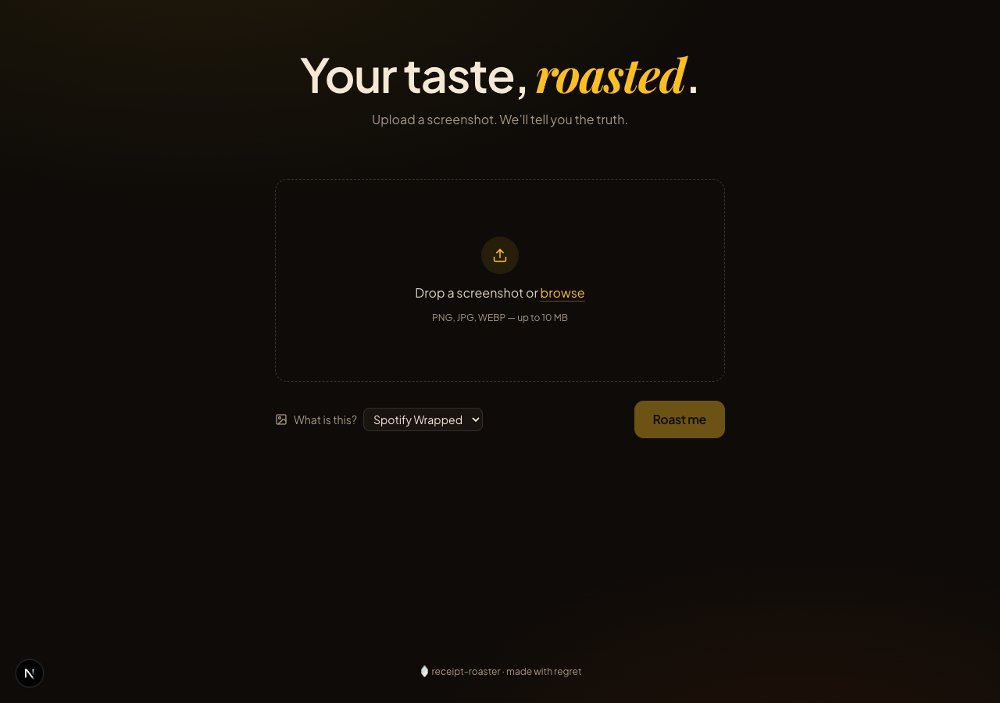

# 🪞 Receipt Roaster

> Your taste, roasted.



Upload your Spotify Wrapped, Letterboxd, Goodreads — anything that exposes your taste — and an AI delivers a sharp, specific, slightly affectionate roast. Download it as a 1080×1350 image card and post the receipts.

## Stack

- Next.js 15 · App Router · TypeScript
- Tailwind CSS v4 (CSS-first `@theme`)
- OpenAI `gpt-4o` vision
- `html-to-image` for PNG export
- Framer Motion · lucide-react
- Playfair Display · Plus Jakarta Sans · JetBrains Mono

## Setup

```bash
pnpm install
cp .env.example .env.local
# add your OPENAI_API_KEY
pnpm dev
```

Open http://localhost:3000.

## How it works

1. You upload a screenshot.
2. The image (as a data URL) is POSTed to `/api/roast`.
3. The route hands the image to `gpt-4o` with a system prompt tuned for sharp, specific, redemptive roasts (see `src/lib/prompt.ts`).
4. The model returns `{ roast, vibe }` as JSON.
5. The result renders in the UI; an offscreen card at 1080×1350 is rasterized to PNG via `html-to-image` for download.

## Out of scope (v0.1)

- Auth, accounts, persistence, history
- Social platform sharing beyond Web Share API
- Analytics / rate limiting
- i18n

## License

MIT
